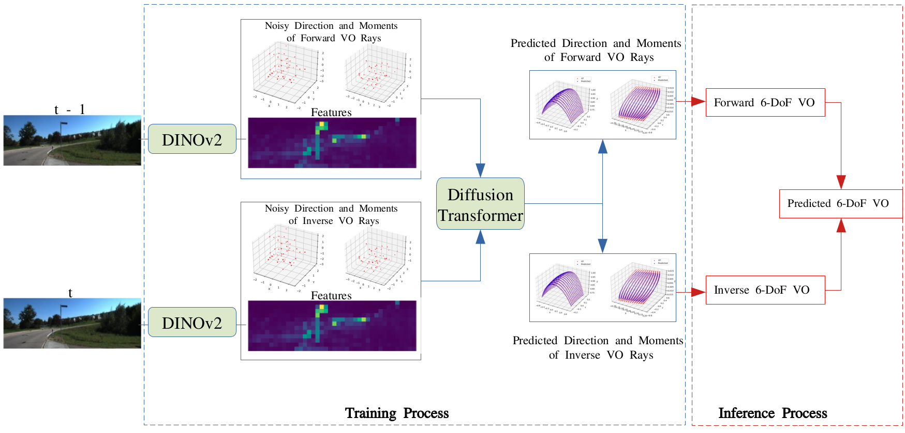

# RayVO
This repository contains the code for the paper: Ray Visual Odometry in the 2025 IEEE/RSJ International Conference on Intelligent Robots and Systems (IROS).

## Framework of RayVO

<!-- 
  -->

<div align="center">
  
</div>

This picture shows the framework of Ray Visual Odometry: (1) Training process: For each image in the pair of images, we denoise the noisy GT rays, either in inverse or forward pose, conditioned on their features from DINOv2 to predict the rays for forward pose and inverse pose. (2) Inference process: During the inference time, given two ray bundles, inverse and forward, we first calculate the corresponding Lie algebra (6-DoF) for them. Then, the final predicted 6-DoF VO is calculated as the average of these two poses.

## ⚙️ Environment Setup

```bash
# Create Environment
conda env create -f environment.yml
conda activate raydiffusion

# Install Additional Dependencies
## Install LieGroups
git clone https://github.com/utiasSTARS/liegroups.git
cd liegroups
pip install -e .
cd ..

## Install PySLAM
git clone https://github.com/utiasSTARS/pyslam.git
cd pyslam
pip install -e .
cd ..
```

## 🏋️ Training
```bash
# To train the ray-based model with ray-based loss
## To train the model with inverse and forward rays
python train_inverse_forward_ray_loss.py

## To train the ray-based model with identity and forward rays
python train_identity_forward_ray_loss.py

# To train the ray-based model with 6DoF-based loss
python train_inverse_forward_6dof_loss.py

# To train the ray-based model with a hybrid of ray-based and 6DoF-based loss
python train_inverse_forward_hybrid_loss.py

# To train the 6DoF-based model with 6DoF-based loss
python train_inverse_forward_6dof_layer.py
```


## 📊 Evaluation
```bash
# To evaluate the ray-based model outputting inverse and forward rays
python evaluate_inverse_forward.py

# To evaluate the ray-based model outputting identity and forward rays
python evaluate_identity_forward.py

# To evaluate the 6DoF-based model
evaluate_6dof_layer.py
```


## Video of RayVO
The following video shows how the prediction of direction and moments evolves along the trajectory of Seq 10 on Kitti, both in 3D space and across three different 2D projection spaces.

<div align="center">
  
  
  
  
</div>

<!--
[](visualization/video_trajectory_ray_representation.mp4)
-->

## 📖 Citation

If you find this work useful, please cite:

```bibtex
@article{xu2025rayvo,
  title={Ray Visual Odometry},
  author={Xu, Fanqi and Almalioglu, Yasin and Trigoni, Niki},
  journal={IEEE},
  year={2025}
}
```
