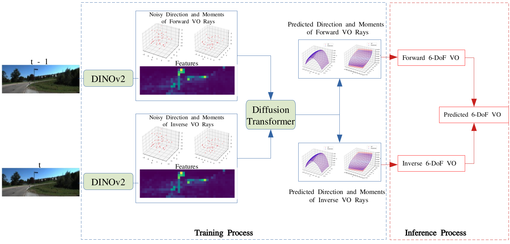

# RayVO
This repository contains the code for the paper: Ray Visual Odometry.

## Framework of RayVO

<!-- 
  -->

  

This picture shows the framework of Ray Visual Odometry: (1) Training process: For each image in the pair of images, we denoise the noisy GT rays, either in inverse or forward pose, conditioned on their features from DINOv2 to predict the rays for forward pose and inverse pose. (2) Inference process: During the inference time, given two ray bundles, inverse and forward, we first calculate the corresponding Lie algebra (6-DoF) for them. Then, the final predicted 6-DoF VO is calculated as the average of these two poses.

## Video of RayVO
The following video shows how the prediction of direction and moments evolve along the trajectory of Seq 10 on Kitti, both in 3D space and across three different 2D projection spaces.

  
  
  
  

<!--

-->
